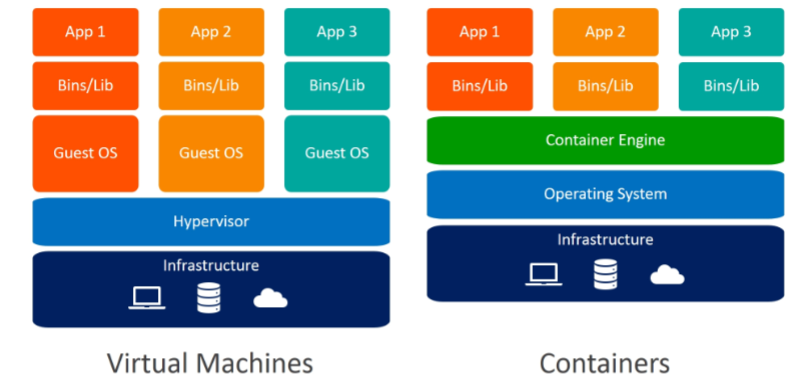
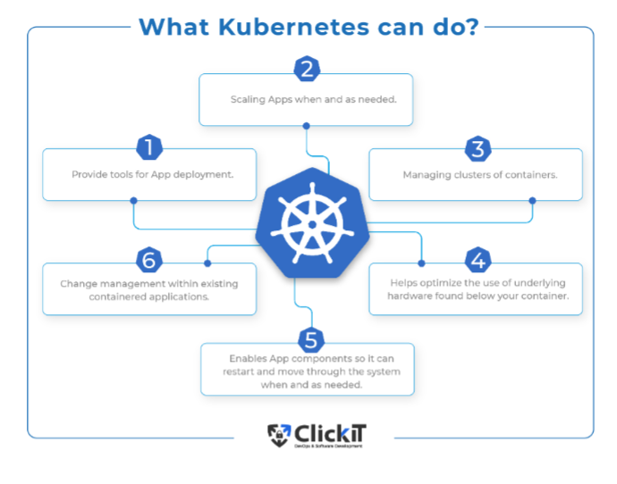
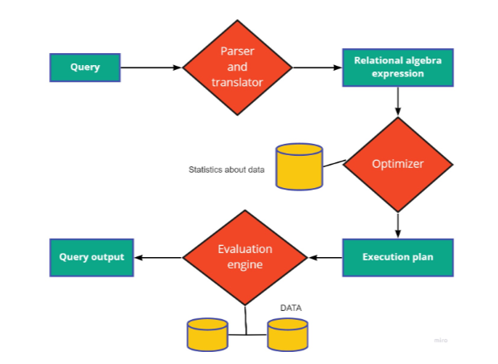

### Pruebas de stress

son pruebas donde la aplicacion se sobrecarga más allá de sus limites, busca si el programa se cae o no.\
El pico de demanda llevará a la máquina a entregar su maximo thrghput\

### disponibilidad 
tasa de tiempo en servicio, uptime del sistema. no disponibilidad es que los usuarios no tiene acceso a las aplicaciones, se puede ocacionar por factores externos a nosotros.

Vamos a ver dos tipos de aplicaciones, las de web movil y la app instalable, esta es la más recomendada, pero esta es la más cara, lahibrida tiene menor costo pero es más pesado y la experiencia de usuario puede no ser tan buena, tienen un intensivo uso de CPU

Para escribir el backend se puede usar casi cualquier lenguaje, pero el frontend  es más limitado, como react, html, css, entre otros.

Nosotros vamos a usar mayormente rails para trabajar el backend que va a tener CSS, HTML y Javascript (JS) convinado.

#### Modelo de página unica (SPA)
No hay recarga de página, son puros JS que modifican el doc, todo son peticiones de AJAX.

El browser puede mandar al servidor un request, que no son originadas por el usuario, sino por codigo, así el usuario puede ocupar la página, esto es asincronico. (se puede ocupar cualquier request GET, PUT, POST...)\
el response puede ser un json o un codigo o texto.\
esto se ocupa mucho para las single page application.

Las debilidades son que cada hipervículo tiene que tener un javascript. La URL ya no tiene sentido, no son indexable, el search engine se ve afectado negativamente.

Para aumentar la escalabilidad se puede aumentar los servidores, entre otras cosas.

#### Arquitectura
Lo estatico es HTML, JS y CSS y la parte transaccional es a medida de API, tambien las bases de datos. Lo transaccional necesitamos CPU, lo estatico es barato y lo otro es caro.

##### Content Delivery Networks CDN

Son infrastructura utilizadas por los desarrolladores de apps para facilitar 

--------------------------------
#### Clase 2

## Backend escalable

Cual es el maximo throughput?\
La demanda por la aplicacion puede ser fluctuante, estacionalidad de las ventas.\
Vamos a ocupar instalaciones "bare metal", actualización de sofware constante, seguridad física y seguridad de cosas naturales, como el agua. Hay depresación muy rapida, tipo 5 años uno queda depresiado, vida útil corta.\
### Virtualización / Hipervisores 
Hipervisor: monitor de maquina virtual, es una capa de software que permite ejecutar múltiples sistemas operativos en un solo sistema físico, compartiendo un mismo hardware. Virtualiza el hardware del sistema (CPU, memoria) creando un sistema que pueden correr varias procesos simultaneos.

hay dos tipos:
- Tipo 1 (bare metal): Se ejecuta directamente sobre el hardware sin requerir sistema operativo (KVM).
-Tipo 2 (hosted): Se ejecuta como aplicacion del usuario, virtual box.

Un hipervisor bare metal puede ejecutar N sistemas operativos distintos con bajo desperdicio de recurso y en cada uno desplegar aplicaciones y servicios distintos 

### Contenedores: Dockers
Dockers es un entorno de contenerización más usados por los desarrolladores de aplicaciones web y móviles./
Una imagen es como un archivo zip, y el deploy se hace en contenedores.\
Nuestras aplicaciones las empaquetaremos en imagenes y seran desplegadas en dockers como imagen, una ve subidas las imagenes pueden basarse con otras imagenes, usaremos Debian que es el que tiene lo más escencial de Linux. Podemos usar nuestra propia infrastructura bare metal o podemos arrendar una maquina virtual.

nota: ver y revisar el ppt del profe y ver las imagenes.

#### Docker compose
Docker Engine provee una red virtual de comunicación en cada host en donde opera. Docker Compose es una herramienta de Docker que permite ejecutar varios contenedores con un mismo 

#### Arquitectura del backend
la Aplicacion rails es un monolito, es por capas.
- Ventajas: Alta performance pues en un mismo proceso del servidor de app es posible acceder a toda la funcionalidad.
- Desventajas: Hacer aplicaciones de gran tamaño, es dificil ir actualizando con nuevas funciones y se hacen muy complejas.

Los microservicios descomponen la aplicación en muchos servicios de pequeños tamaños que se comunican mediante APIs\
Los serverless 

---- 
##### resumen control 2

Caracteristicas de un dispositivo movil:
- Portabilidad
- Autonomia energética (uso de batería)
- Interfaz táctil
- Conectividad inalámbrica
- Electrónica integrada
- Cámaras integradas
- Sensores E/S (son los distintos sensores que trae un teléfono)
- Sistema operativo móvil
- Ecosistema del software

Escalabilidad:\
Capacidad de un sistema para satisfacer las solicitudes de un acantidad de clientes, sin perdida de rendimiento ni funcionamiento. Las distintas aplicaciones deben ser capaz de manejar picos altos de traficos en los distintos eventos.

Throughput: Cantidad de solicitudes satisfechas por unidad de tiempo.

Tiempo de respuesta: Cuanto toma una solicitud en ser respondida.

Pruebas de carga:\
El sistema es probado bajo un cierto nivel de carga y su respuesta es analizada. Se busca saber como responde el sistema a distintas cargas, así se identifican las fallas y arreglar los cuello de botella y mejorar el rendimiento. Hay distintas herramientas para hacer esto.
- Apache JMeter: Una de las más usadas tradicionalmente.
- LoadRunner: Permite hacer test de carga, stress y punta.

Test de stress: Es un tipo de test de carga donde el sistema es exigido más allá de su límite, busca ver si el sistema es resilente y ver si se cae o no, cuando llega a un nivel máximo de throughput la máquina no vuele a aceptar nuevas solicitudes por lo que la app se vuelve inutil.

Disponivilidad: Se mide por tasa de tiempo en servicio, el *uptime*. La no disponibilidad puede ocasionarse por factores fuera de control de quiénes opeeran el servidor del cual la app es cliente.

Hay dos escenarios posibles para diseñar aplicaciones que sean escalables y con alta disponibilidad.
- La aplicación de tipo web, que el móvil accedad desde el navegador.
- aplicación de tipo descargable.
    - Aplicación nativa: Se ejecutan directamente sobre el sistema operativo.
    - Aplicaciones híbridas: Se ejecutan sobre una capa de compatibilidad multiplataform, que permite el desarrollo único epaquetable y distribuible para varios ecosistemas.

Server side Rendering(SSR): El servidor recibe una peticion del cliente y envia de vuelta una página HTML con tags < script >, < Link > y CSS, el cliente debe cargar los CSS y los script, el cliente ejecuta las JS y la página se hace interactiva, cada botón causará que el servidor retone una respuesta con HTML, JS y CSS.

Single Page Application (SPA):
- El browser carga un esqueleto mínimo de página.
- Luego el browser realiza todas las peticiones al servidor por via XHR y espera recibir JSON.
- Pueden cargarse en forma dinámica y ásincronica.

**Fortalezas:**
- Se mantiene interactiva con el usuario incluso cuando la conexión es interrumpida.
- La aplicación de frontend puede usar el almacenamiento local del navegadpr web.
- No hay recargas de página.

**Debilidades:**
- Los hipervínculos en la aplicación son atendidos por JS en el frontend.
- Las URL en la barra de direcciones ya no tienen sentido.
- No es indexable por motores de busqueda.

Client Side Rendering (CSR):
- El cliente obtiene HTML, CSS y JS.
- Todas las respuestas son objetos JSON.
- El código de JS en el frontend actueliza el DOM.

Como mejorar la escalabilidad: Aumentar servidores aumenta el throughput y con ello aumenta la cantidad de clientes, pero es costoso.

Arquitectura: Las partes estáticas de una aplicación HTML, JS, CSS. Las partes transaccionales pueden hacerse mediante APIs

Backend: procesa transacciones que involucran recursos, se ocupan APIs que son utilizadas por el frontend.\
La escalabilidad del backend se mejora aumentando vertical, que es mejorar la capacidad de los servidores o horizontal, que es aumentar los servidores.

Hipervisores
-
 Monitor de maquina virtual, es una capa de software que permite ejecutar múltiples sistemas operativos en un solo sistema físico. Virtualiza el hardware del sistema, creando capade abstracción que permite que varios sistemas operativos funcionen simultáneamente en la misma máquina física, de forma aislada entre si.
- Tipo 1 Bare metal: se ejecuta directamente sobre el hardware sin requerir un sistema operativo, ejemplo KVM.
- Tipo 2 hosted: Se ejecuta como aplicación de usuario en un sistema operativo.

El bare metal puede ejecutar N sistemas operativos con bajo desperdicio de recursos y esos pueden ejecutar distintas aplicaciones y servicios, pero sisgue siendo un nodo de bare metal, lo que hace que mayores cargas de un servicio en una máquina virtual afecta el rendimiento de las otras máquinas virtuales.

Contenedores
-
Existe una forma de virtualización ligera que se basa en utilización de contenedores, esta no virtualiza el hardware, sino que virtualiza el sistema operativo.\
Un motor de contenedores que ejecuta en el sistema operativo administra el ciclo de vida de los contenedores, permite ejecutar apliciones en contenedoresque comparten el mismo kernel del sistema operativo.

Dockers
-
Es un entorno de contenerización más usado por los desarrolladores.

Los contenedores los podemos ejecutar en nuestro propio bare metal, también máquinas virtuales.\
Docker Compose es una herramienta que permite ejecutar varios contenedores con un mismo engine.\
Kubernetes es un orquestador de contenedores y es el más poderoso

Monolito
-
- Ventajas: Performance, ya que un mismo proceso de servidor de aplicación es posible acceder a toda la funcionalidad del backend.
- Desventajas: Para aplicaciones de gran tamaño es muy dificil comunicar nuevas funciones y se hace cada vez más complejo el monolito.

Caching
-
La idea es mantener respuestas a consultas repetidas en el caché asi evitar el return repetido desde la base de datos y la renderización de la respuesta.\ 
Se ocupa una base de datos no relacional, Redis (Remote Dictionary Server).\
Ver PPT clase 3 de ejemplos de codigo.

Las bases de datos relacionales tienen uan aquitectura dificil y que el desarrollador debe entender, a pesar de esto ayuda a mejorar el rendimiento, ya que optimiza las consultas.

Faltas para bases de datos relacionales:
- Falta de indexación en columnas claves.
- Abuso de comodines.
- Columnas innecesarias.
- Uniones no optimizadas.
- Consultas anidadas no optimas.
- No usar consultas no preparadas.
- No analizar los planes de ejecución.
- Evitar el operador OR.

